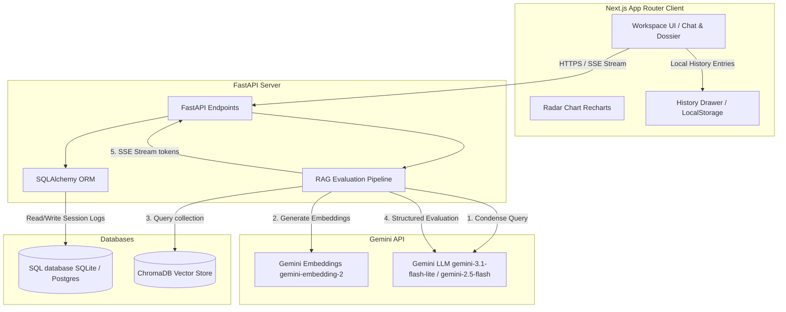
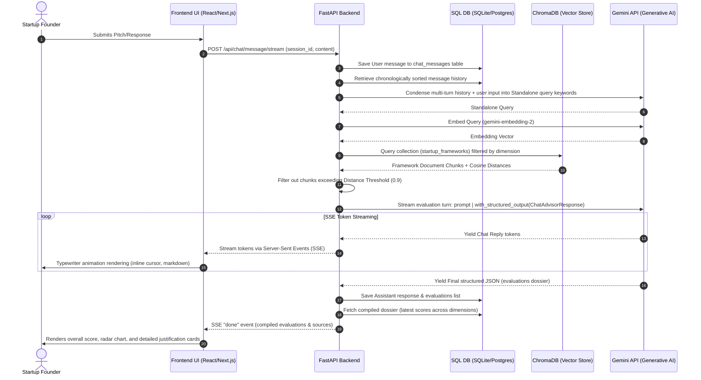

# Z-Combinator: AI Startup Pitch Evaluator & RAG Chat Advisor 🚀

Z-Combinator is a premium, AI-powered startup pitch evaluator and conversational advisor. It allows startup founders to iterate on their ideas and compile investment dossiers by cross-referencing pitches against **150+ frameworks** from top venture capital firms and startup thinkers including **Y Combinator (YC Startup School)**, **Andreessen Horowitz (a16z)**, **Sequoia Capital**, **NFX**, **First Round Review**, and **Naval Ravikant**.

The application utilizes a high-performance **RAG (Retrieval-Augmented Generation)** pipeline to evaluate pitches across 6 dimensions, streaming responses in real-time and compiling a dynamic evaluation dossier.

---

## 🏗️ System Architecture

Z-Combinator is built using a decoupled architecture, separating a responsive Next.js frontend from a robust Python/FastAPI backend backed by a multi-database storage layer.



---

## 🔄 RAG Message Stream & Processing Flow

When a user interacts with the Advisor, the system processes their query through multiple stages of query condensation, vector search, parallel structured LLM execution, and Server-Sent Events (SSE) streaming:



---

## 🌟 Key Features

### 🧠 Advanced RAG & LLM Pipeline (Backend)
- **Multi-Turn Query Condensation**: Context-aware LLM pre-processing rephrases conversational history and the user's latest message into a standalone, keyword-rich query optimized for ChromaDB.
- **Strict Semantic Distance Thresholding**: Cosine distance values are filtered against a threshold (`0.9`). Chunks with low relevance are ignored to prevent the LLM from fabricating citations.
- **AI-Assisted Timing Suggestion**: The system guides users to submit details on 5 metrics (Market, Team, Competition, Moat, Execution), while the LLM automatically deduces and evaluates the **Timing** dimension based on industry macro trends, technological shifts, and consumer behavior shifts.
- **LangChain Structured Outputs**: Utilizes `with_structured_output` bound to Pydantic validation schemas to guarantee valid, parseable JSON payloads without regex parsing overhead.
- **Robust Model Fallbacks**: Automatically retries primary evaluations using backup models (`gemini-3.1-flash-lite` -> `gemini-2.5-flash`) in case of rate limits or model outages.
- **Asynchronous Parallelism**: Evaluates and attaches framework metadata for all 6 dimensions in parallel using `asyncio.gather`, ensuring response latency is kept to a minimum (<15 seconds p90).

### 🖥️ Premium Editorial Design (Frontend)
- **Monochrome & High Contrast Aesthetic**: Built around a clean, high-contrast monochrome design system aligning with startup publication grids.
- **Bouncy Spring Animations**: Leverages Framer Motion physics-based bouncy springs (`stiffness: 450, damping: 15`) for all major CTA cards and responsive actions.
- **Interactive Radar Chart**: A custom Recharts radar visualization displaying active dimension scores with subtle gradient fills and glow shadows.
- **SSE streaming & Organic Typewriter**: Renders incoming token streams with a dynamic character-by-character typewriter effect (using variable chunk steps based on text length) and an inline blinking cursor flush with the text.
- **Markdown & List Rendering**: Converts incoming raw markdown formatting (`**bold**`, bullet points, and numbered lists) into styled React nodes on-the-fly, pre-closing incomplete markdown syntax during typewriter streaming to avoid layout jumps.
- **Local History & New Chat Flow**: Includes an slide-out History Drawer displaying overall scores and dimensional metrics saved in local storage. Refreshes/visits automatically initialize a clean session, and a **New Chat** button generates fresh session states.

---

## 🗄️ Database Schema & Data Models

### 1. SQL Database (SQLAlchemy Relational Schema)
Used to persist conversational logs and compiled dossiers across sessions. Supports SQLite locally and PostgreSQL in production.

#### `chat_sessions`
| Column | Type | Description |
| :--- | :--- | :--- |
| **`id` (PK)** | `String(255)` | Unique UUID identifying the evaluation session. |
| **`title`** | `Text` | Human-readable title of the chat. |
| **`created_at`** | `DateTime` | UTC timestamp of session creation. |

#### `chat_messages`
| Column | Type | Description |
| :--- | :--- | :--- |
| **`id` (PK)** | `Integer` | Auto-incrementing identifier. |
| **`session_id` (FK)** | `String(255)` | Reference to `chat_sessions.id` (Cascades on delete). |
| **`role`** | `String(50)` | Role of the message speaker (`user` or `assistant`). |
| **`content`** | `Text` | The text content of the message. |
| **`evaluations`** | `JSON` | List of newly evaluated dimension scores, justifications, and sources. |
| **`created_at`** | `DateTime` | UTC timestamp of message dispatch. |

---

### 2. Vector Store Schema (ChromaDB)
Holds chunked paragraphs from YC, a16z, NFX, Sequoia, and First Round startup frameworks.

* **Collection Name**: `startup_frameworks`
* **Embedding Model**: `models/gemini-embedding-2` (768-dimension vectors)
* **Metadata Fields**:
  - `dimension`: The target dimension (`market`, `team`, `timing`, `competition`, `moat`, `execution`).
  - `source_org`: The framework author organization (`yc`, `a16z`, `nfx`, `sequoia`, `firstround`).
  - `source_title`: Title of the original publication/article.

---

## 🛠️ Installation & Setup

### Prerequisites
- [Node.js](https://nodejs.org/) (v18 or higher)
- [Python](https://www.python.org/) (v3.10 or higher)
- A Gemini API Key from [Google AI Studio](https://aistudio.google.com/)

---

### 1. Backend Setup (FastAPI)

Navigate to the `backend` folder:
```bash
cd backend
```

Create and activate a virtual environment:
```bash
# Windows
python -m venv venv
venv\Scripts\activate

# macOS/Linux
python3 -m venv venv
source venv/bin/activate
```

Install requirements:
```bash
pip install -r requirements.txt
```

Create a `.env` file inside the `backend` folder:
```env
GEMINI_API_KEY=your_gemini_api_key_here
GEMINI_MODEL=gemini-3.1-flash-lite
CHROMA_PERSIST_DIR=./chroma_data
DATABASE_URL=sqlite:///./chat_history.db
CORS_ORIGINS=http://localhost:3000
RATE_LIMIT=10/minute
```

Run the FastAPI application locally:
```bash
python -m uvicorn main:app --port 8000 --reload
```
*The backend server will start on [http://localhost:8000](http://localhost:8000).*

---

### 2. Frontend Setup (Next.js)

Navigate to the root project directory:
```bash
cd ..
```

Install Node dependencies:
```bash
npm install
```

Create a `.env.local` file in the root directory:
```env
NEXT_PUBLIC_API_URL=http://localhost:8000
```

Start the Next.js development server:
```bash
npm run dev
```
*Open [http://localhost:3000](http://localhost:3000) in your browser.*

---

## 🧪 Verification & Building

To check for type errors and verify that the production build is fully optimized:
```bash
npm run build
```
This command compiles TypeScript and generates static paths (`/`, `/about`, `/evaluate`, `/methodology`) to verify code correctness.

---

## 📄 License
This project is open-source and licensed under the MIT License.
